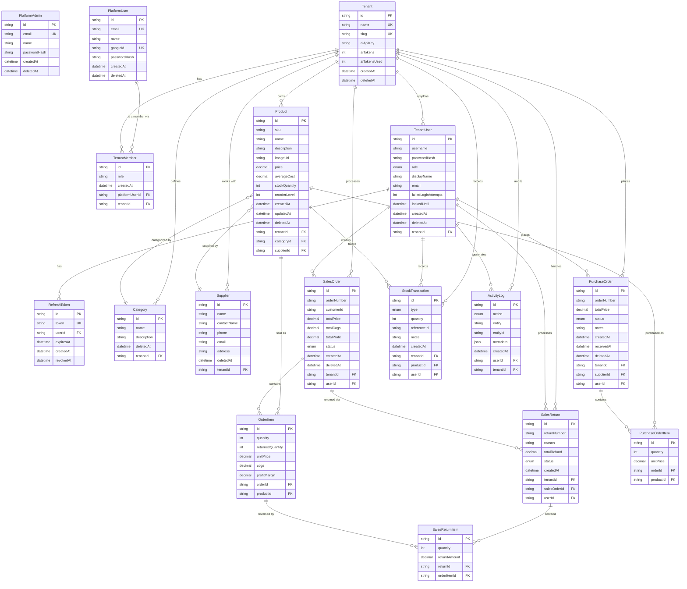
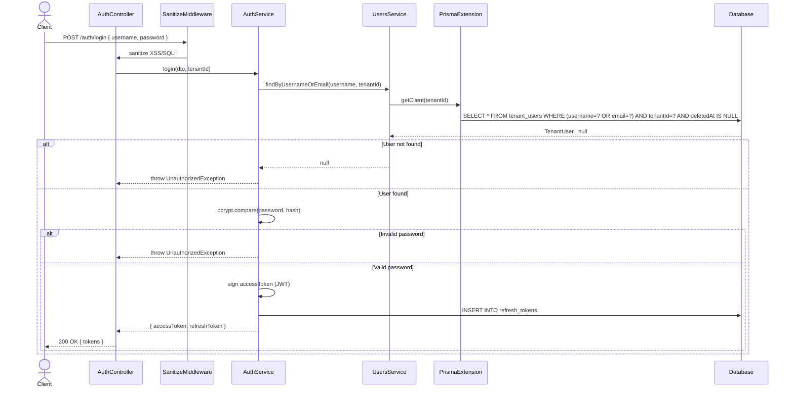
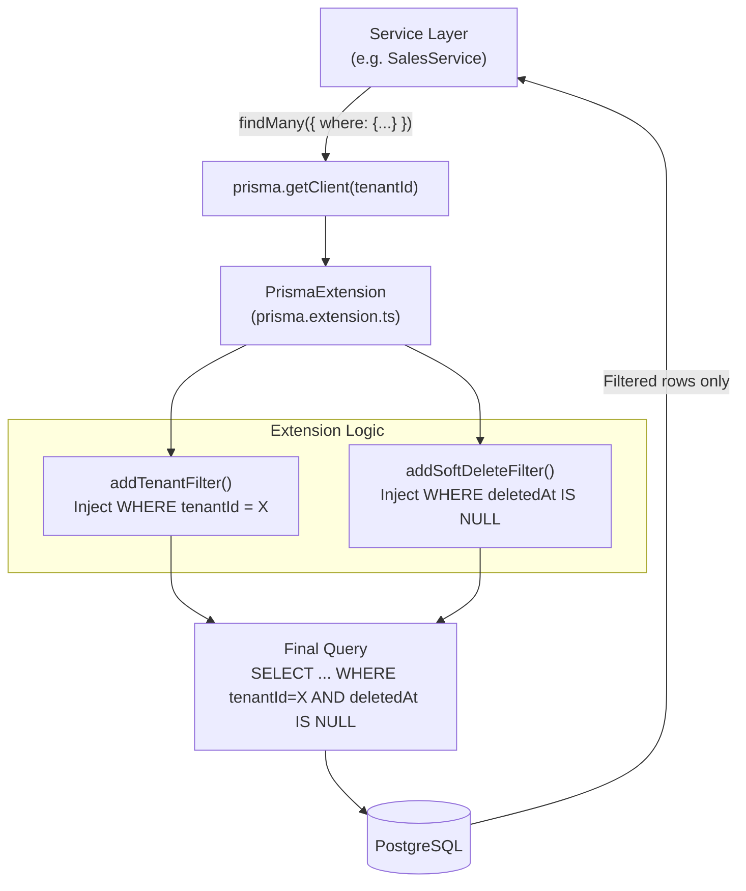
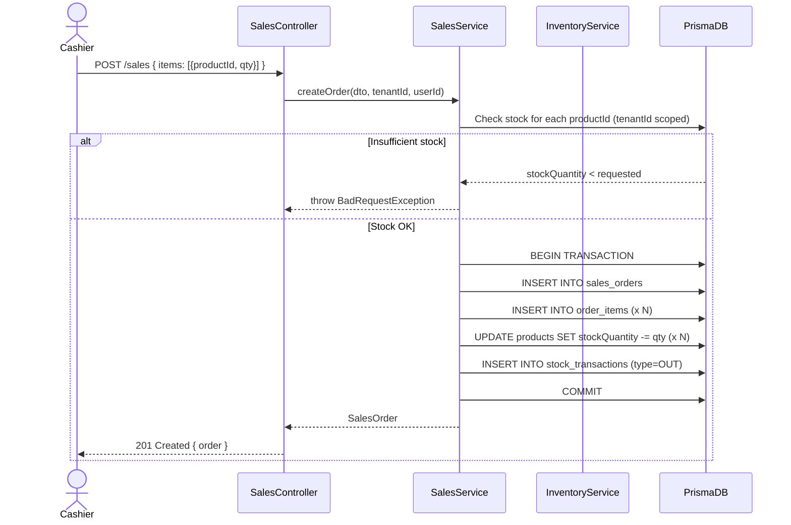
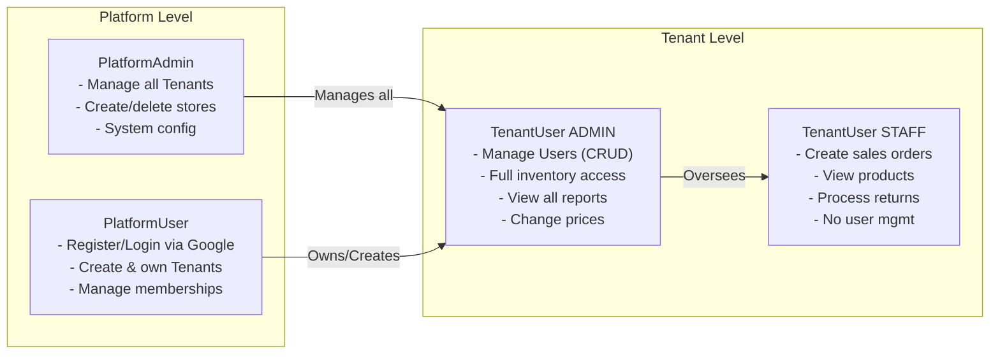

# CrackPOS — Complete System Documentation & Diagrams

---

## 1. Entity Relationship Diagram (ERD) — Lengkap

---

## 2. Application Architecture — Module Diagram

```mermaid
graph TB
    subgraph "Entry Point"
        Main["main.ts\n(Bootstrap, CORS, Swagger,\nHelmet, Throttling, Validation)"]
    end

    subgraph "App Module"
        AppMod["AppModule"]
    end

    subgraph "Core Infrastructure"
        PrismaMod["PrismaModule\n(Global)"]
        PrismaSvc["PrismaService"]
        PrismaExt["prisma.extension.ts\n(Tenant Filter +\nSoft Delete)"]
        PrismaSvc --> PrismaExt
    end

    subgraph "Auth & Users"
        AuthMod["AuthModule"]
        AuthCtrl["AuthController"]
        AuthSvc["AuthService\n(JWT, Bcrypt, Tokens)"]
        UsersMod["UsersModule"]
        UsersCtrl["UsersController"]
        UsersSvc["UsersService"]

        AuthCtrl --> AuthSvc
        AuthSvc --> UsersSvc
    end

    subgraph "Platform Admin"
        AdminMod["AdminModule"]
        AdminCtrl["AdminController"]
        AdminSvc["AdminService"]
        AdminCtrl --> AdminSvc
    end

    subgraph "Business Logic"
        SalesMod["SalesModule"]
        SalesCtrl["SalesController"]
        SalesSvc["SalesService"]
        SalesCtrl --> SalesSvc

        PurchaseMod["PurchaseModule"]
        PurchaseCtrl["PurchaseController"]
        PurchaseSvc["PurchaseService"]
        PurchaseCtrl --> PurchaseSvc

        ReturnsMod["ReturnsModule"]
        ReturnsCtrl["ReturnsController"]
        ReturnsSvc["ReturnsService"]
        ReturnsCtrl --> ReturnsSvc

        InventoryMod["InventoryModule"]
        InventoryCtrl["InventoryController"]
        InventorySvc["InventoryService"]
        InventoryCtrl --> InventorySvc
    end

    subgraph "Catalog"
        ProductsMod["ProductsModule"]
        ProductsCtrl["ProductsController"]
        ProductsSvc["ProductsService"]
        ProductsCtrl --> ProductsSvc

        CatMod["CategoriesModule"]
        CatCtrl["CategoriesController"]
        CatSvc["CategoriesService"]
        CatCtrl --> CatSvc

        SuppMod["SuppliersModule"]
        SuppCtrl["SuppliersController"]
        SuppSvc["SuppliersService"]
        SuppCtrl --> SuppSvc
    end

    subgraph "AI & Data"
        AIMod["AIModule"]
        AICtrl["AIController"]
        AISvc["AIService\n(Python AI Proxy)"]
        AICtrl --> AISvc

        AIDataMod["AIDataModule"]
        AIDataCtrl["AIDataController"]
    end

    subgraph "Observability"
        DashMod["DashboardModule"]
        DashCtrl["DashboardController"]
        DashSvc["DashboardService"]
        DashCtrl --> DashSvc

        LogMod["ActivityLogModule"]
        LogCtrl["ActivityLogController"]

        HealthMod["HealthModule"]
        HealthCtrl["HealthController"]
    end

    subgraph "Common (Shared)"
        Guards["Guards\n(JwtAuth, PlatformJwt,\nTenantThrottler, CSRF)"]
        Filters["Filters\n(AllExceptions,\nPrismaClientException)"]
        Interceptors["Interceptors\n(AuditLog, Cache)"]
        Middleware["Middleware\n(SanitizeMiddleware)"]
        Decorators["Decorators\n(CurrentUser,\nRoles, Tenant)"]
    end

    Main --> AppMod
    AppMod --> PrismaMod
    AppMod --> AuthMod & UsersMod & AdminMod
    AppMod --> SalesMod & PurchaseMod & ReturnsMod & InventoryMod
    AppMod --> ProductsMod & CatMod & SuppMod
    AppMod --> AIMod & AIDataMod
    AppMod --> DashMod & LogMod & HealthMod

    PrismaSvc --> SalesSvc & PurchaseSvc & ReturnsSvc
    PrismaSvc --> ProductsSvc & CatSvc & SuppSvc
    PrismaSvc --> InventorySvc & UsersSvc & AdminSvc
    PrismaSvc --> AISvc & DashSvc
```

---

## 3. Login & Authentication Flow

---

## 4. Multi-Tenant Prisma Extension Flow

---

## 5. Stock & Inventory Flow

---

## 6. User Roles & Permission Matrix

---

## 7. Enum Reference

| Enum | Values |
|:---|:---|
| `TenantRole` | `ADMIN`, `STAFF` |
| `TransactionType` | `IN`, `OUT`, `ADJUSTMENT`, `RETURN` |
| `PurchaseOrderStatus` | `PENDING`, `RECEIVED`, `CANCELLED` |
| `SalesOrderStatus` | `PENDING`, `COMPLETED`, `CANCELLED` |
| `ReturnStatus` | `PENDING`, `COMPLETED`, `REJECTED` |
| `ActivityAction` | `CREATE`, `UPDATE`, `DELETE`, `LOGIN`, `LOGOUT` |
